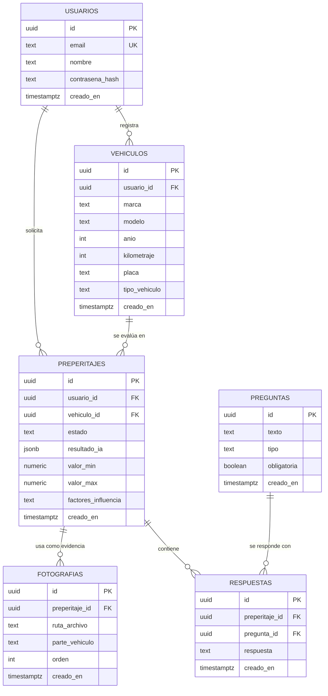

# Diagrama de base de datos

Este diagrama representa el modelo de datos del sistema de preperitaje vehicular con IA, diseñado sobre **Supabase (PostgreSQL)** como Backend as a Service. La base de datos almacena usuarios, vehículos, evidencia fotográfica, respuestas al cuestionario y los resultados de los análisis generados por la IA.

## Descripción de las tablas

| Tabla | Propósito | Relación con requerimientos |
|---|---|---|
| `usuarios` | Datos de autenticación y perfil del usuario. | RF01 (registro e inicio de sesión). |
| `vehiculos` | Datos básicos del vehículo evaluado, asociados a su dueño. | RF02 (marca, modelo, año, kilometraje, placa). |
| `preperitajes` | Registro de cada análisis solicitado, incluye el JSON devuelto por la IA y el rango de valor estimado. | RF05, RF06, RF07, RF08, RF09. |
| `fotografias` | Referencias a las imágenes cargadas en el almacenamiento de Supabase, con la parte del vehículo a la que pertenecen. | RF03 (subida de múltiples fotografías). |
| `preguntas` | Catálogo del cuestionario de estado y antecedentes. | RF04 (cuestionario). |
| `respuestas` | Respuestas del usuario, asociadas a un preperitaje y a una pregunta. | RF04, RF05 (envío a la IA junto con las fotos). |

## Notas de implementación en Supabase

- **Autenticación:** el módulo `auth` nativo de Supabase gestiona registro, inicio de sesión y sesiones; la tabla `usuarios` complementa el perfil (se vincula al `id` del usuario autenticado).
- **Almacenamiento:** las fotografías se guardan en un bucket privado de Supabase Storage; `fotografias.ruta_archivo` guarda la referencia al objeto.
- **Row Level Security (RLS):** se habilita RLS en todas las tablas para que cada usuario solo pueda leer/editar sus propios vehículos, preperitajes y evidencias (relacionado con RNF03 y la historia de *Protección de la información*).
- **Resultado de la IA:** el JSON de respuesta de Gemini se almacena en `preperitajes.resultado_ia` para poder regenerar el informe sin volver a llamar al modelo.
- **Repetición del análisis:** al re-ejecutar el análisis (PV-09), se puede crear un nuevo `preperitaje` conservando el historial del anterior.

## Fuente
Generado a partir de los requerimientos e historias de usuario (`DOC/02_REQUERIMIENTOS.md`, `DOC/03_HISTORIAS_USUARIO.md`) y del diagrama de componentes (`DOC/07_DIAGRAMA_COMPONENTES.md`) usando el prompt en `DOCIA/07_PROMPT_DIAGRAMAS.md`.