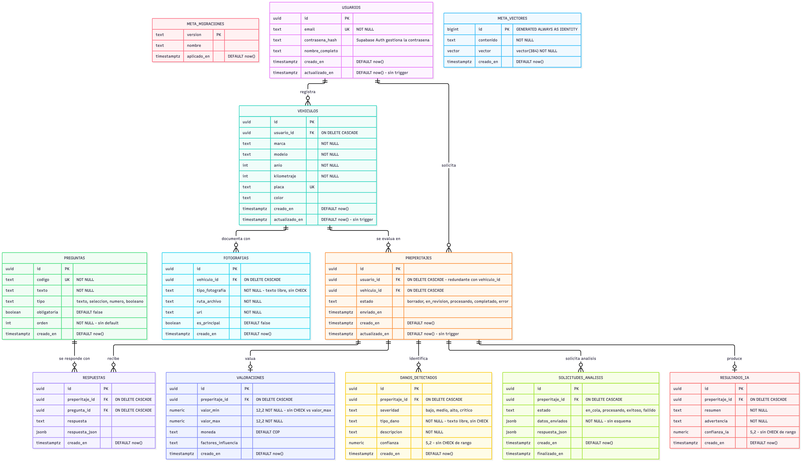
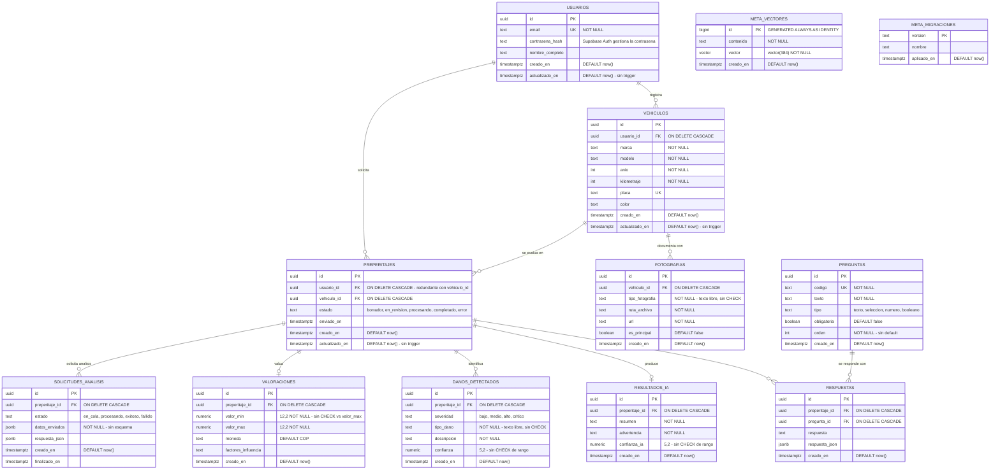

# Diagrama de base de datos

Este diagrama refleja el **esquema real implementado** en PostgreSQL 16.3 con la extensión `pgvector`. La fuente es el volcado `base_datos/DATABASE POSTGRESQL ES.sql`, generado después de aplicar `base_datos/migracion_espanol.sql` sobre la base original.

El esquema se organiza en dos esquemas: `public` (datos de la aplicación) y `meta` (infraestructura interna: migraciones y almacén vectorial del RAG).

## Descripción de las tablas

### Esquema `public`

| Tabla | Propósito | Relación con requerimientos |
|---|---|---|
| `usuarios` | Perfil de usuario. La contraseña real la administra `auth` de Supabase. | RF01 |
| `vehiculos` | Datos del vehículo, uno por conductor, con placa única global. | RF02 |
| `preperitajes` | Cabecera de cada preperitaje: estado del proceso y referencias a usuario y vehículo. | RF05, RF07 |
| `fotografias` | Evidencia fotográfica **del vehículo**, reutilizable entre preperitajes. | RF03 |
| `preguntas` | Catálogo del cuestionario, con código estable y orden de presentación. | RF04 |
| `respuestas` | Respuestas a un preperitaje, en texto libre o JSON estructurado. | RF04, RF05 |
| `resultados_ia` | Salida textual del modelo: resumen y advertencia preliminar. | RF05, RF07 |
| `danos_detectados` | Daños detectados por la IA, con severidad y confianza. | RF05 |
| `valoraciones` | Rango de valor estimado y factores que lo explican. | RF06 |
| `solicitudes_analisis` | Cola de análisis asíncrono: datos enviados y respuesta recibida. | RF05, PV-09 |

### Esquema `meta`

| Tabla | Propósito |
|---|---|
| `meta.vectores` | Almacén vectorial (pgvector, 384 dimensiones) para RAG sobre la norma técnica. |
| `meta.migraciones` | Control de versión de migraciones. |

## Claves foráneas

Las 10 FK son `ON DELETE CASCADE` y **ninguna es `NOT NULL`**, así que todas las relaciones son opcionales: un registro puede existir sin su padre.

| Tabla | Columna | Referencia | Constraint |
|---|---|---|---|
| `vehiculos` | `usuario_id` | `usuarios(id)` | `vehiculos_usuario_id_fkey` |
| `preperitajes` | `usuario_id` | `usuarios(id)` | `preperitajes_usuario_id_fkey` |
| `preperitajes` | `vehiculo_id` | `vehiculos(id)` | `preperitajes_vehiculo_id_fkey` |
| `fotografias` | `vehiculo_id` | `vehiculos(id)` | `fotografias_vehiculo_id_fkey` |
| `respuestas` | `preperitaje_id` | `preperitajes(id)` | `respuestas_preperitaje_id_fkey` |
| `respuestas` | `pregunta_id` | `preguntas(id)` | `respuestas_pregunta_id_fkey` |
| `resultados_ia` | `preperitaje_id` | `preperitajes(id)` | `resultados_ia_preperitaje_id_fkey` |
| `danos_detectados` | `preperitaje_id` | `preperitajes(id)` | `danos_detectados_preperitaje_id_fkey` |
| `valoraciones` | `preperitaje_id` | `preperitajes(id)` | `valoraciones_preperitaje_id_fkey` |
| `solicitudes_analisis` | `preperitaje_id` | `preperitajes(id)` | `solicitudes_analisis_preperitaje_id_fkey` |

## Restricciones de dominio

| Constraint | Tabla | Valores permitidos |
|---|---|---|
| `preperitajes_estado_check` | `preperitajes` | `borrador`, `en_revision`, `procesando`, `completado`, `error` |
| `solicitudes_analisis_estado_check` | `solicitudes_analisis` | `en_cola`, `procesando`, `exitoso`, `fallido` |
| `preguntas_tipo_check` | `preguntas` | `texto`, `seleccion`, `numero`, `booleano` |
| `danos_detectados_severidad_check` | `danos_detectados` | `bajo`, `medio`, `alto`, `critico` |

## Índices

| Índice | Tabla | Columnas |
|---|---|---|
| `idx_vehiculos_usuario_id` | `vehiculos` | `usuario_id` |
| `idx_vehiculos_placa` | `vehiculos` | `placa` |
| `idx_preperitajes_estado` | `preperitajes` | `estado` |
| `idx_fotografias_vehiculo_id` | `fotografias` | `vehiculo_id` |
| `idx_respuestas_preperitaje_id` | `respuestas` | `preperitaje_id` |

Los índices de las claves `UNIQUE` (`usuarios_email_key`, `vehiculos_placa_key`, `preguntas_codigo_key`) también los crea PostgreSQL de forma automática.

Faltan índices en las FK de `preperitajes` (`usuario_id`, `vehiculo_id`) y en las cinco tablas hijas de `preperitajes`, que son las que más se consultan al abrir un resultado.

## Row Level Security

RLS está habilitado en **3 de las 10 tablas de `public`**: `usuarios`, `vehiculos`, `preperitajes`.

| Tabla | RLS |
|---|---|
| `usuarios` | Habilitado |
| `vehiculos` | Habilitado |
| `preperitajes` | Habilitado |
| `fotografias` | **No habilitado** |
| `respuestas` | **No habilitado** |
| `resultados_ia` | **No habilitado** |
| `danos_detectados` | **No habilitado** |
| `valoraciones` | **No habilitado** |
| `solicitudes_analisis` | **No habilitado** |
| `preguntas` | No aplica (catálogo de lectura) |

Las seis tablas marcadas sin RLS incluyen fotografías, respuestas y resultados de otros usuarios. Con los grants por defecto de Supabase, cualquier rol `anon` o `authenticated` puede leerlos. **Es el punto más urgente a corregir.**

## Notas de implementación

- **Evidencia fotográfica reutilizable:** las fotos cuelgan de `vehiculos`, no de `preperitajes`. Un mismo vehículo puede registrar varios preperitajes sin volver a subir imágenes.
- **Trazabilidad de la evidencia usada:** no existe FK que ligue `preperitajes` con las fotografías concretas de un análisis. Esa información solo sobrevive dentro de `solicitudes_analisis.datos_enviados`, un `jsonb` sin esquema. No es posible reconstruir un informe histórico con certeza.
- **`preperitajes.usuario_id` es redundante:** se puede derivar de `vehiculos.usuario_id`. Mantenerlo permite consultar los preperitajes de un usuario sin unir contra `vehiculos`, pero abre la puerta a que ambos valores se contradigan.
- **Repetición del análisis:** `solicitudes_analisis` permite varios intentos por preperitaje con su propio estado (`en_cola` → `procesando` → `exitoso`/`fallido`) y sus tiempos. Es lo que hace posible el re-análisis sin perder el resultado anterior.
- **Almacenamiento:** las fotos viven en un bucket de Supabase Storage; `fotografias.ruta_archivo` guarda la clave del objeto y `url` la ruta de acceso.
- **Resultado de la IA:** no se guarda como JSON único sino normalizado en cuatro tablas (`resultados_ia`, `danos_detectados`, `valoraciones`, `solicitudes_analisis`), lo que permite consultar cada parte por separado.
- **Moneda:** `valoraciones.moneda` tiene `DEFAULT 'COP'` pero no hay `CHECK` que restrinja los valores.

## Limitaciones conocidas del esquema

Estas diferencias ya existen en la base y conviene resolverlas antes de dar por cerrado el modelo:

1. **RLS ausente en seis tablas** (ver sección anterior).
2. **`actualizado_en` no se mantiene.** `usuarios`, `vehiculos` y `preperitajes` declaran la columna con `DEFAULT now()`, pero el esquema no define ningún trigger ni función que la actualice. El valor queda congelado en el momento del INSERT.
3. **Respuestas duplicables.** `respuestas` no tiene `UNIQUE (preperitaje_id, pregunta_id)`, así que una misma pregunta puede responderse varias veces dentro del mismo preperitaje, incluso las marcadas como `obligatoria`.
4. **Rango de valor sin validar.** `valoraciones` no tiene `CHECK (valor_min <= valor_max)`.
5. **Relaciones 1:1 sin garantía.** `resultados_ia` y `valoraciones` son conceptualmente una fila por preperitaje, pero ninguna tiene `UNIQUE (preperitaje_id)`. El diagrama las dibuja como `0..1` por intención de diseño, no por restricción real.
6. **Enums perdidos en las fotos y los daños.** `fotografias.tipo_fotografia` y `danos_detectados.tipo_dano` son texto libre. Las partes del vehículo que definía el diseño original (frente, trasera, laterales, interior, motor, llantas, tablero) no están restringidas por un `CHECK`.
7. **Confianzas sin rango.** `confianza_ia` y `confianza` son `numeric(5,2)` sin `CHECK` de que estén entre 0 y 1.
8. **`orden` sin default** en `preguntas`: todo INSERT debe proporcionarlo.
9. **Placa única global.** `vehiculos.placa` tiene `UNIQUE`, así que dos usuarios no pueden registrar el mismo vehículo. Es una decisión de negocio, no técnica, y conviene confirmarla.
10. **`usuarios.contrasena_hash` sin usar.** La columna existe pero Supabase Auth gestiona la contraseña. Conviene eliminarla o documentar que se reserva para migración de usuarios.

## Migración de nombres al español

El esquema se creó originalmente en inglés (`users`, `assessments`, `vehicle_photos`…). `base_datos/migracion_espanol.sql` renombra los 12 objetos de tabla, 62 columnas, 5 índices, 29 constraints y traduce los valores de los 4 CHECK. Solo cambia identificadores y vocabulario: no altera tipos, claves ni datos.

- `base_datos/DATABASE POSTGRESQL` — volcado original en inglés, conservado como registro histórico.
- `base_datos/DATABASE POSTGRESQL ES.sql` — volcado actual tras la migración.

La migración se verificó ejecutándola sobre PostgreSQL 16.3 con `pgvector`: conserva los datos existentes, traduce los valores de estado ya almacenados y los CHECK resultantes rechazan los valores en inglés.

## Fuente

Volcado `base_datos/DATABASE POSTGRESQL ES.sql` (PostgreSQL 16.3 + pgvector). Las etapas previas de requerimientos, historias de usuario y diagramas están en `02_REQUERIMIENTOS.md`, `03_HISTORIAS_USUARIO.md` y `07_DIAGRAMA_COMPONENTES.md`.

Este documento sustituye a la propuesta de diseño anterior, que describía seis tablas en español y no coincidía con el esquema implementado.