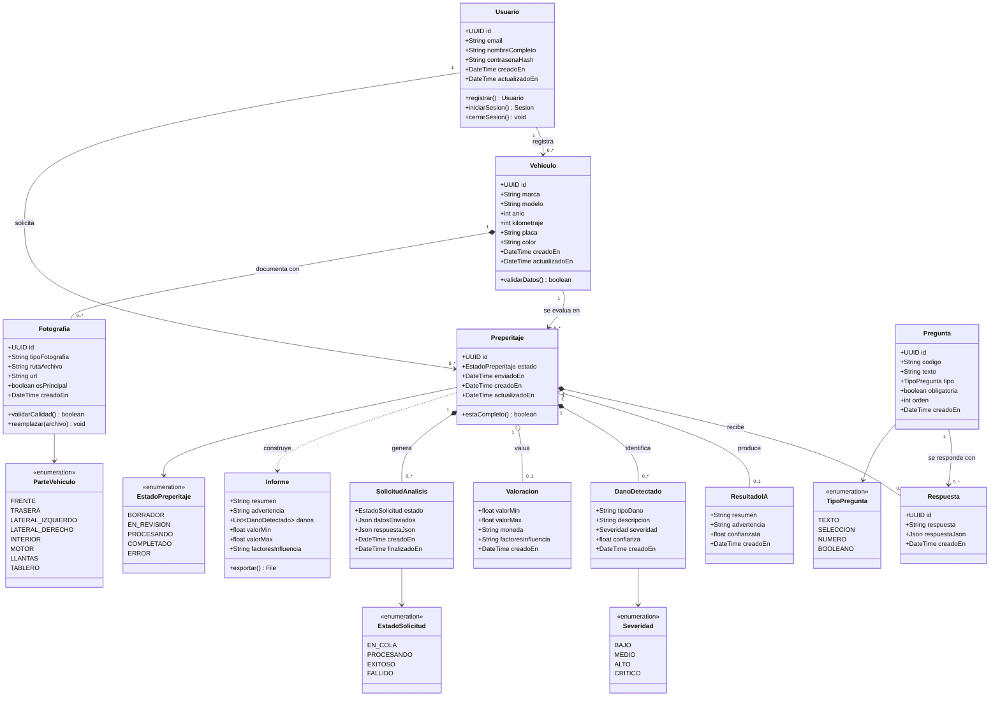

# Diagrama de clases

Este diagrama representa las clases principales de **AutoCheck** y sus relaciones. Está derivado del modelo de datos real (`08_DIAGRAMA_BASE_DATOS.md`): cada clase persistente corresponde a una tabla, salvo `Informe`, que es una vista derivada que no se almacena.

Los nombres de las clases y de sus atributos coinciden con los del esquema en español, de modo que la correspondencia entre diagrama de clases y base de datos es directa.

## Correspondencia con las tablas

| Clase | Tabla | Persistencia |
|---|---|---|
| `Usuario` | `usuarios` | Tabla |
| `Vehiculo` | `vehiculos` | Tabla |
| `Preperitaje` | `preperitajes` | Tabla |
| `Fotografia` | `fotografias` | Tabla |
| `Pregunta` | `preguntas` | Tabla |
| `Respuesta` | `respuestas` | Tabla |
| `ResultadoIA` | `resultados_ia` | Tabla |
| `DanoDetectado` | `danos_detectados` | Tabla |
| `Valoracion` | `valoraciones` | Tabla |
| `SolicitudAnalisis` | `solicitudes_analisis` | Tabla |
| `Informe` | — | **No se persiste**: vista derivada |
| `EstadoPreperitaje`, `EstadoSolicitud`, `TipoPregunta`, `Severidad`, `ParteVehiculo` | — | Enumeraciones |

## Notas de diseño

- **La fotografía pertenece al vehículo, no al preperitaje.** Un mismo vehículo puede tener varios preperitajes y las fotos se reutilizan entre ellos. La consecuencia es que no se sabe con certeza qué fotos usó un análisis concreto: esa información solo queda en `solicitudes_analisis.datos_enviados`, un JSON sin esquema.
- **La salida de la IA está normalizada en cuatro tablas,** no en un JSON único: `resultados_ia` (resumen y advertencia), `danos_detectados` (lista de daños), `valoraciones` (rango de valor) y `solicitudes_analisis` (cola y respuesta cruda). Cada parte se puede consultar por separado.
- **`Informe` no se persiste:** se construye en el momento a partir de `ResultadoIA` + `DanoDetectado` + `Valoracion` del preperitaje. Por eso el diagrama lo dibuja con dependencia débil (`..>`).
- **Composición (`*--`):** las fotos cuelgan del vehículo y las respuestas, daños y solicitudes cuelgan del preperitaje. Al eliminar el padre, `ON DELETE CASCADE` elimina los hijos.
- **`Preperitaje.usuario_id` es redundante** con `Vehiculo.usuario_id`. Se conserva para consultar rápido, pero nada garantiza que ambos coincidan.
- **`advertencia` es obligatoria** (`NOT NULL` en `resultados_ia`) y debe incluir siempre el mensaje de que el resultado es orientativo y no reemplaza un peritaje profesional.
- **`ParteVehiculo` no está respaldado por la base.** `fotografias.tipo_fotografia` y `danos_detectados.tipo_dano` son texto libre sin `CHECK`. La enumeración existe a nivel de diseño pero la base no la impone.
- **`contrasenaHash` está presente pero sin uso:** la gestiona el módulo `auth` de Supabase. Conviene eliminar la columna o documentar que se reserva para una posible migración de usuarios.
- **`confianzaIa` y `confianza` no están acotadas** entre 0 y 1 en la base.

## Fuente

Derivado del modelo de datos real (`08_DIAGRAMA_BASE_DATOS.md`), que a su vez se generó desde el volcado `base_datos/DATABASE POSTGRESQL ES.sql`. Los requerimientos y las historias de usuario están en `02_REQUERIMIENTOS.md` y `03_HISTORIAS_USUARIO.md`.